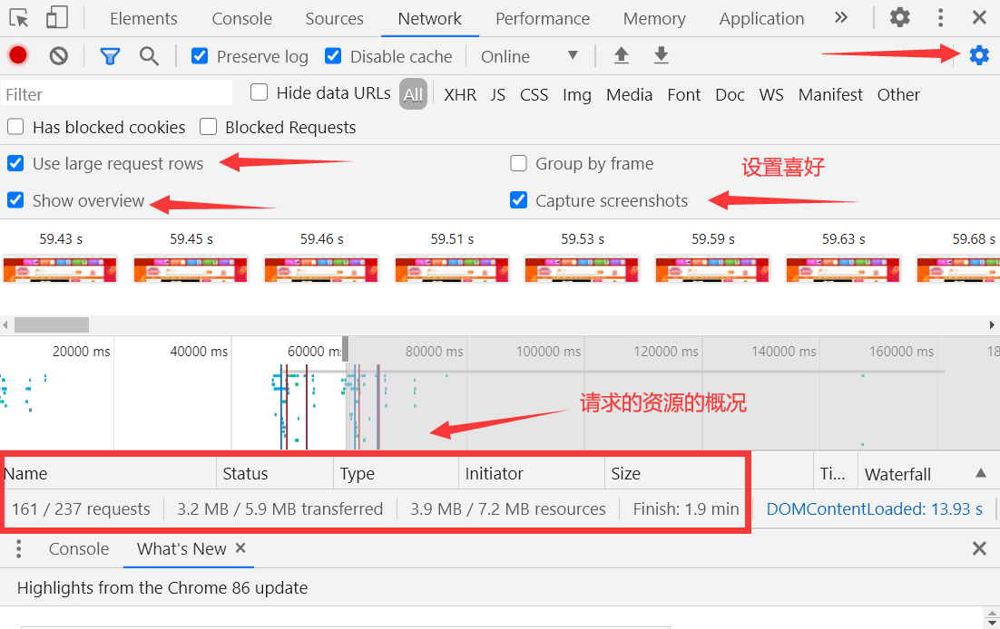
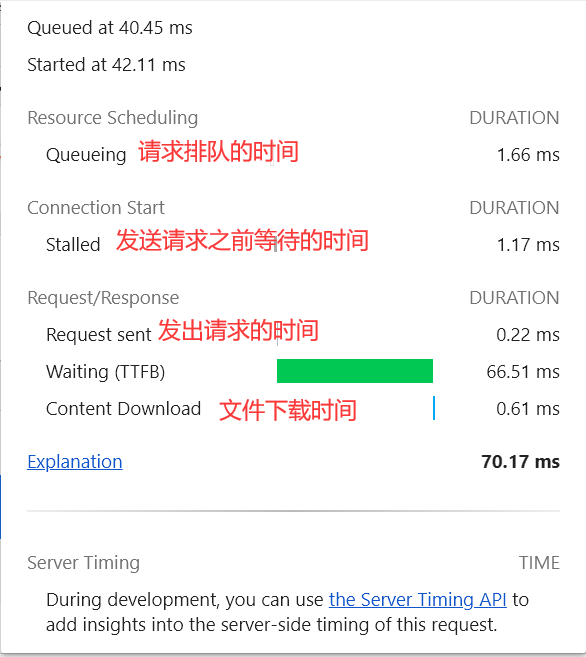
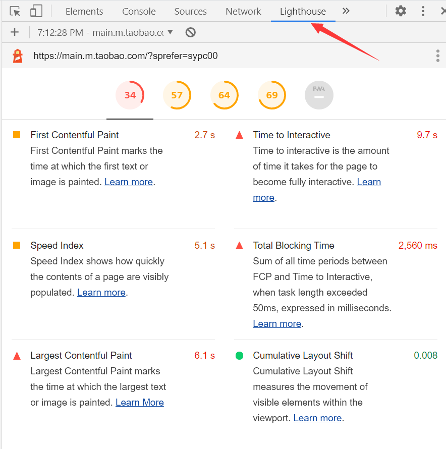
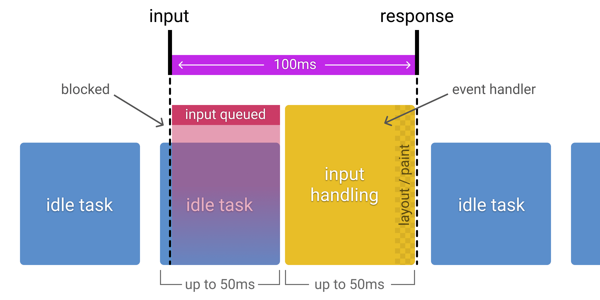

## 性能优化的指标和工具

## 1-1 性能指标和优化目标

性能指标就是进行性能优化所要参考的标准。接下来打开一个网站，打开控制台。

可以看看瀑布图，这里可以看到在请求一个资源的时候具体都有哪些环节进行了耗时。其中一个比较重要的信息就是 **TTFB（Time To First Byte**），它可以评估接收到第一个字节所花费的时间。它能反映出**后台处理数据的能力**以及**网络的情况**。

接下来我们可以看看 lighthouse 提供的性能测试结果：

上面提到的都是网络加载的性能。除此之外，我们还要考虑用户在使用这个网站的时候的交互响应（比如实时搜索，二级导航栏出现的速度等等），还有动画的速度（一秒 60 帧才会觉得不卡）。我们可以调出工具来看帧率。

还有就是异步请求，希望每一个异步请求能在一秒内拿到数据。

所以总结一下：

**性能优化-加载：**

- 理解瀑布图
- 基于 HAR 存储与重建性能信息（water fall 里面右击可以保存为 har 文件）
- 速度指数（Speed Index），light house 里面的东西，低于 4s 就是绿色
- 重要测量指标：
  - Speed Index
  - TTFB
  - 页面加载时间
  - 首次渲染

**性能优化-响应：**

- 交互动作的反馈时间
- 帧率 FPS（1秒60帧）
- 异步请求的完成时间（1秒）

## 1-2 RAIL测量模型 

### 什么是 RAIL 模型？

RAIL 是一种以用户为中心的性能模型。每个网络应用均具有与其生命周期有关的四个不同方面，且这些方面以不同的方式影响着性能：

- Response 响应，指的是网站给用户的反馈
- Animation 动画
- Idle 空闲，我们要加大主线程的 idle 时间，主线程不卡死才能来处理交互（与第一点 response 呼应）
- Load 加载时间

### RAIL 评估标准

- **Response**：用户的输入到响应的时间不超过100ms，给用户的感受是瞬间就完成了。

  - 事件处理函数在50ms内完成，考虑到idle task的情况，事件会排队，等待时间大概在50ms。适用于click，toggle，starting animations等，不适用于drag和scroll。
  - 复杂的 js 计算尽可能放在后台，如web worker，避免对用户输入造成阻塞。
  - 超过50ms的响应，一定要提供反馈，比如倒计时，进度百分比等。

  > idle task：除了要处理输入事件，浏览器还有其它任务要做，这些任务会占用部分时间，一般情况会花费50ms的时间，输入事件的响应则排在其后。

  idle task 对 input response 的影响：
  

- **Animation**：在 10ms 内产生一帧。因为不感觉卡顿的话就是 1 秒 60 帧，那么一帧就是 16 ms。浏览器绘制也需要一点时间，大概是 6 ms。

  - 在一些高压点上，比如动画，不要去挑战cpu，尽可能地少做事，如：取 offset，设置 style 等操作。尽可能地保证 60 帧的体验。

  - 在渲染性能上，针对不同的动画做一些特定优化。

    > 动画不只是UI的视觉效果，以下行为都属于
    >
    > - 视觉动画，如渐隐渐显，tweens，loading等
    > - 滚动，包含弹性滚动，松开手指后，滚动会持续一段距离
    > - 拖拽，缩放，经常伴随着用户行为

- **Idle**：最大化空闲时间，以增大50ms内响应用户输入的几率。
  - 用空闲时间来完成一些延后的工作，如先加载页面可见的部分，然后利用空闲时间加载剩余部分，此处可以使用 requestIdleCallback
  - 在空闲时间内执行的任务尽量控制在50ms以内，如果更长的话，会影响input handle的pending时间
  - 如果用户在空闲时间任务进行时进行交互，必须以此为最高优先级，并暂停空闲时间的任务

- **Load**：传输内容到页面可交互的时间不超过5秒，如果页面加载比较慢，用户的交点可能会离开。加载很快的页面，用户平均停留时间会变长，跳出率会更低，也就有更高的广告查看率。优化加载速度，可以根据设备、网络等条件。目前，比较好的一个方式是，让你的页面在一个中配的3G网络手机上打开时间不超过 5 秒。对于第二次打开，尽量不超过 2 秒
  - 在手机设备上测试加载性能，选用中配的3G网络（400kb/s，400ms RTT），可以使用 [WebPageTest](https://www.webpagetest.org/easy) 来测试
  - 要注意的是，即使用户的网络是4G，但因为丢包或者网络波动，可能会比预期的更慢
  - [禁用渲染阻塞的资源，延后加载](https://web.dev/render-blocking-resources/)
  - 可以采用 [lazy load](https://web.dev/native-lazy-loading/)，[code-splitting](https://web.dev/reduce-javascript-payloads-with-code-splitting/) 等 [其他优化](https://web.dev/fast/) 手段，让第一次加载的资源更少

### 性能测量工具

- [Chrome DevTools](https://developers.google.com/web/tools/chrome-devtools)：开发测试、性能评测
- [Lighthouse](https://web.dev/measure/)：网站整体质量评估
- [WebPageTest](https://webpagetest.org/easy)：多测试地点、全面性能报告

## 1-3 使用WebPageTest评估Web网站性能

## 1-4 使用LightHouse分析性能

## 1-5 使用Chrome DevTools分析性能

## 1-6 常用的性能测量APIs

