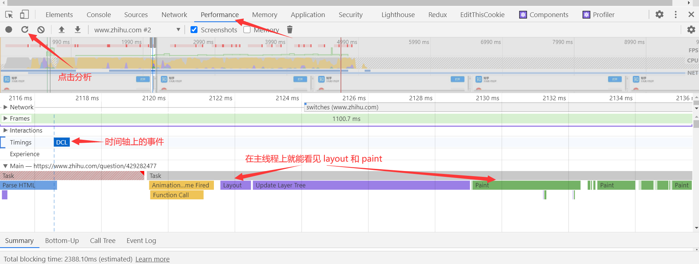

## 渲染优化

## 2-1 关键渲染路径

我读了 [这一篇](https://developers.google.com/web/fundamentals/performance/critical-rendering-path/constructing-the-object-model) 觉得可以理解关键渲染路径了。在这其中需要注意的就是，在渲染成具体像素点的时候，最后还有一步合成（composite）的操作。因为浏览器在渲染具体的像素点的时候并不是画在同一层的（有点像 ps 的图层）。为了记一下我还是写一下关键渲染路径吧：

javascript —> style —> layout —> paint —> composite

## 2-2 布局（layout）与绘制（paint）

- 渲染树只包含网页需要的节点
- 布局计算每个节点精确的**位置和大小** — “盒模型”
- 绘制是像素化每个节点的过程

布局和绘制是关键渲染路径中最重要的步骤，也是**开销最大**的步骤。有一些动画可以直接进行 gpu 加速，这样可以跳过 layout 和 paint。

### 影响重排的操作

第一次布局的时候就是 layout，后面因为一些操作而改变了布局那就是 reflow（重排）。影响重排的操作：

- 添加/删除元素
- 操作 styles
- display: none
- offsetLeft, scrollTop, clientWidth
- 移动元素位置
- 修改浏览器大小，字体大小

如何利用 devtools 来看 layout 和 paint 所花费的时间？



### 避免 layout thrashing

- 避免重排（回流），可以用能使 gpu 加速的 api。
- 读写分离（批量地操作，这样才能尽可能减少布局的抖动）

看看下面会产生布局抖动的代码：

```javascript
const update = (timestamp) => {
    for (let i = 0; i < cards.length; i++) {
        // 通过 offsetTop 计算 width
        cards[i].style.width = ((Math.sin(cards[i].offsetTop + timestamp / 1000) + 1) * 500) + 'px';
    }
    window.requestAnimationFrame(update);
}
window.addEventListener('load', update);
```

它每次更改 card 的 width 的时候都要去读取 offsetTop，而为了读取最新的 offsetTop，它又不得不去强制渲染和计算上一轮的 width。这就在很短时间内引发了很多强制渲染（强制布局），就引起了布局抖动的现象。布局抖动给人的感觉就是，动画很卡顿。

### 使用 FastDom 来防止布局抖动

它的 github 地址：[fastdom](https://github.com/wilsonpage/fastdom)

它的原理是批量地读和批量地写。对上面的代码改写之后：

```javascript
const update = (timestamp) => {
    for (let i = 0; i < cards.length; i++) {
        fastdom.measure(() => {
            let top = cards[i].offsetTop; // 先读取值
            fastdom.mutate(() => { // 然后修改
                cards[i].style.width = ((Math.sin(top + timestamp / 1000) + 1) * 500) + 'px';
            })
        })
    }
    window.requestAnimationFrame(update);
}
window.addEventListener('load', update);
```