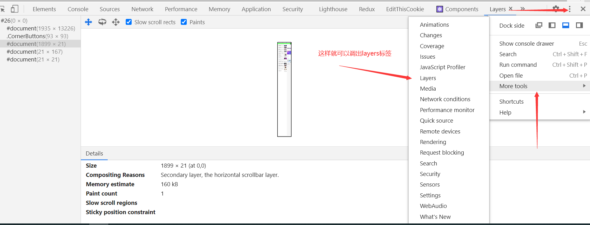
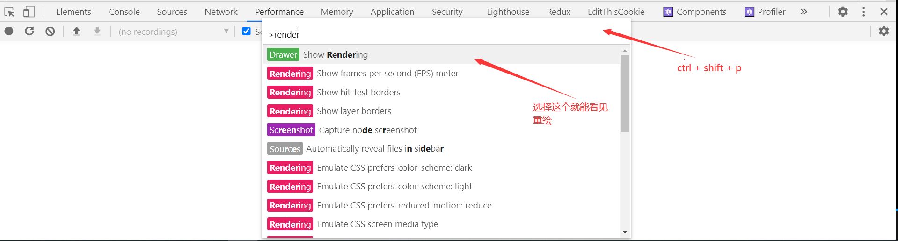
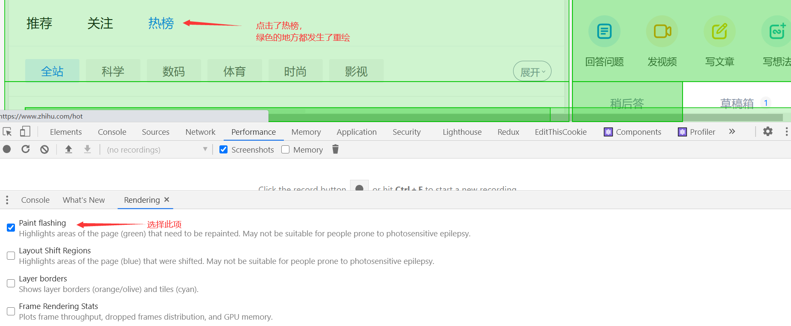
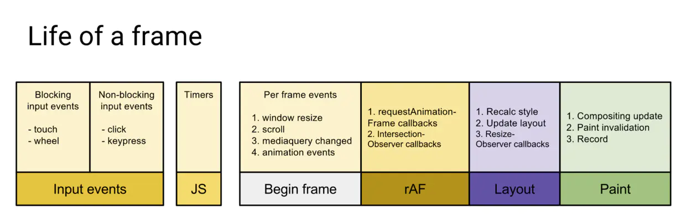

## 渲染优化

## 2-1 关键渲染路径

我读了 [这一篇](https://developers.google.com/web/fundamentals/performance/critical-rendering-path/constructing-the-object-model) 觉得可以理解关键渲染路径了。在这其中需要注意的就是，在渲染成具体像素点的时候，最后还有一步合成（composite）的操作。因为浏览器在渲染具体的像素点的时候并不是画在同一层的（有点像 ps 的图层）。为了记一下我还是写一下关键渲染路径吧：

javascript —> style —> layout —> paint —> composite

## 2-2 布局（layout）与绘制（paint）

- 渲染树只包含网页需要的节点
- 布局计算每个节点精确的**位置和大小** — “盒模型”
- 绘制是像素化每个节点的过程

布局和绘制是关键渲染路径中最重要的步骤，也是**开销最大**的步骤。有一些动画可以直接进行 gpu 加速，这样可以跳过 layout 和 paint。

### 影响重排的操作

第一次布局的时候就是 layout，后面因为一些操作而改变了布局那就是 reflow（重排）。影响重排的操作：

- 添加/删除元素
- 操作 styles
- display: none
- offsetLeft, scrollTop, clientWidth
- 移动元素位置
- 修改浏览器大小，字体大小

如何利用 devtools 来看 layout 和 paint 所花费的时间？


### 避免 layout thrashing

- 避免重排（回流），可以用能使 gpu 加速的 api。
- 读写分离（批量地操作，这样才能尽可能减少布局的抖动）

看看下面会产生布局抖动的代码：

```javascript
const update = (timestamp) => {
    for (let i = 0; i < cards.length; i++) {
        // 通过 offsetTop 计算 width
        cards[i].style.width = ((Math.sin(cards[i].offsetTop + timestamp / 1000) + 1) * 500) + 'px';
    }
    window.requestAnimationFrame(update);
}
window.addEventListener('load', update);
```

它每次更改 card 的 width 的时候都要去读取 offsetTop，而为了读取最新的 offsetTop，它又不得不去强制渲染和计算上一轮的 width。这就在很短时间内引发了很多强制渲染（强制布局），就引起了布局抖动的现象。布局抖动给人的感觉就是，动画很卡顿。

### 使用 FastDom 来防止布局抖动

它的 github 地址：[fastdom](https://github.com/wilsonpage/fastdom)

它的原理是批量地读和批量地写。对上面的代码改写之后：

```javascript
const update = (timestamp) => {
    for (let i = 0; i < cards.length; i++) {
        fastdom.measure(() => {
            let top = cards[i].offsetTop; // 先读取值
            fastdom.mutate(() => { // 然后修改
                cards[i].style.width = ((Math.sin(top + timestamp / 1000) + 1) * 500) + 'px';
            })
        })
    }
    window.requestAnimationFrame(update);
}
window.addEventListener('load', update);
```

可以做出总结：把**读**的代码套到 measure 里，把**写**的代码逃到 mutate 里就行了。

## 2-3 复合线程（compositor thread）与图层（layers）

### 复合线程做了什么

- **将页面拆分图层进行绘制再进行复合**。分多个图层的好处就是提高效率，因为有些绘制可能就仅仅改变一个图层。如果全部画在一张画布上，那么一个地方发生改变就可能引起全局的改变。

- 利用 DevTools 了解网页的图层拆分情况
  

- 哪些样式仅影响复合？上面说过，有些样式可以跳过 layout 和 paint，直接进行 composite：

  - transform: translate(npx, npx);  这个可以取代那些位置变化的样式
  - transform: scale(n);  这个可以取代大小变化的样式（width）
  - transform: rotate(ndeg);
  - opacity: 0 ... 1;

  这样的话，在视觉进行变化的同时，不会触发 reflow 和 repaint

### 查看重绘的方法：

- 用 performance 然后进行录制，看看是否有 layout 或 painting 等工作。

- 调出 rendering 查看重绘：
  

  

## 2-4 高频事件处理函数 防抖

一些函数的触发频率非常高，比如 scroll，mousemove，手机端的 touchmove；这些函数会在一帧里触发多次，这就会导致在一帧内要对这类事件进行多次的响应，如果事件处理函数里面的消耗高，那么一帧的任务量就会很重，这样的一帧就没有办法能在 16ms 内完成了，这样画面就会变卡；但是有时候我们得思考，有没有必要在一帧里面处理多次？如果没有必要那就要进行防抖的操作。

对于频繁地重绘的操作可以利用 `requestAnimationRequest`，然后配合防抖。

### requestAnimation 

`requestAnimationFrame` 在一帧中所处的位置如下所示：



`requestAnimationFrame` 会把每一帧中的所有 DOM 操作集中起来，在一次重绘或回流中就完成，并且重绘或回流的时间间隔紧紧跟随浏览器的刷新频率，一般来说，这个频率为每秒60帧。

在隐藏或不可见的元素中，`requestAnimationFrame` 将不会进行重绘或回流，这当然就意味着更少的的 cpu，gpu 和内存使用量。

在没有 `requestAnimationFrame` 方法的时候，执行动画，我们可能使用 `setTimeout` 或 `setInterval` 来触发视觉变化；但是这种做法的问题是：回调函数执行的时间是不固定的，经常会引起丢帧而导致页面卡顿。

归根到底发生上面这个问题的原因在于时机，也就是浏览器要知道何时对回调函数进行响应。**`setTimeout` 或 `setInterval` 是使用定时器来触发回调函数的，而定时器并无法保证能够准确无误的执行，有许多因素会影响它的运行时机，比如说：当有同步代码执行时，会先等同步代码执行完毕，异步队列中没有其他任务，才会轮到自己执行**。并且，我们知道每一次重新渲染的最佳时间大约是 16.6 ms，如果定时器的时间间隔过短，就会造成 [过度渲染](https://link.zhihu.com/?target=https%3A//www.zhangxinxu.com/wordpress/2013/09/css3-animation-requestanimationframe-tween-动画算法/)，增加开销；过长又会延迟渲染，使动画不流畅。

`requestAnimationFrame` 方法不同与 `setTimeout` 或 `setInterval`，它是由系统来决定回调函数的执行时机的，会请求浏览器在下一次重新渲染之前执行回调函数。无论设备的刷新率是多少，**`requestAnimationFrame` 的时间间隔都会紧跟屏幕刷新一次所需要的时间**；需要注意的是这个方法虽然能够**保证回调函数在每一帧内只渲染一次**，但是**如果这一帧有太多任务执行，还是会造成卡顿的；因此它只能保证重新渲染的时间间隔最短是屏幕的刷新时间。**

可以写一个利用 `requestAnimation` 防抖来避免高频时间多次重绘的代码：

```javascript
let cards = document.getElementByClassName('mui');
function changeWidth(rand) {
    for (let i = 0; i < cards.length; i++) {
     	cards[i].style.width = (Math.sin(rand/1000) + 1) * 500 + 'px'; // 会引起高频率的重绘
    }
}

let ticking = false;
window.addEventListener('pointermove', (e) => {
	let pos = e.clientX;
    // 一帧之内触发多次 rAF 也是没有意义的，所以用 ticking 来进行判断，让 rAF 在做完自己的任务之前只执行一次，这样就实现了防抖动
    if (ticking) return;
    ticking = true;
    window.requestAnimationRequest(() => {
        changeWidth(pos);
        ticking = false;
    })
})
```

### requestIdleCallback

来看看浏览器一帧做的工作：


通过上图可看到，一帧内需要完成如下六个步骤的任务：

- 处理用户的交互
- JS 解析执行
- 帧开始。窗口尺寸变更，页面滚去等的处理
- `requestAnimationFrame (rAF)`
- 布局
- 绘制

上面六个步骤完成后没超过 16 ms，说明时间有富余，此时就会执行 `requestIdleCallback` 里注册的任务。

如此一来，假如浏览器一直处于非常忙碌的状态，`requestIdleCallback` 注册的任务有可能永远不会执行。此时可通过设置 `timeout` 来保证执行。

```javascript
var handle = window.requestIdleCallback(callback[, options])
```

- callback：回调，即空闲时需要执行的任务，该回调函数接收一个`IdleDeadline` 对象作为入参。其中 `IdleDeadline`

  对象包含：

  - `didTimeout`，布尔值，表示任务是否超时，结合 `timeRemaining` 使用。
  - `timeRemaining()`，表示当前帧剩余的时间，也可理解为留给任务的时间还有多少。

- options：目前 options 只有一个参数

  - `timeout`。表示超过这个时间后，如果任务还没执行，则强制执行，不必等待空闲。

## 2-5 React 时间调度实现

- rIC 的问题：它的兼容性非常不好，所以需要用别的方式来模拟。
- 通过 rAF 模拟 rIC