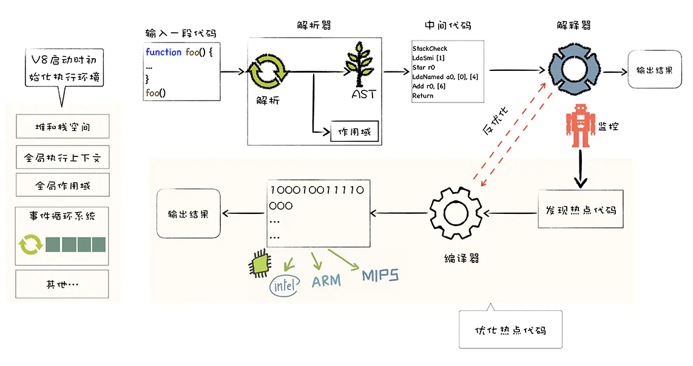

## 代码优化

## 3-1 javascript  的开销和如何缩短解析时间

###  JS开销

我们加载的资源包括 css，js，图片，字体... 这些资源的大小本身可能都非常大，但是 js 在这里面还是开销最重的。因为 js 除了加载以外，它还要进行解析和编译，然后才是执行，这两步也是非常耗时的。下面可以来看看资源大小差不多的情况下，js 和 图片的时间开销：


由上面的图可以发现，他们在网络传输的过程中所消耗的时间是一样的，但是在资源加载的过程中，js 需要解析编译，然后执行；而图片只需要解码和绘制即可。

通过上面的分析，就可以知道优化的方向就是减少 js 编译和运行的时间。

参考文章：[[译\] Javascript开销(Cost)](https://juejin.im/post/6844903565308198920)

### 优化方案

- Code splitting 代码查分，按需加载。

  当前访问路径需要哪些资源就加载哪些资源，不需要的我们给它延迟，访问的时候再去加载。达到减少加载js的目的

- Tree shaking 代码减重

  举例来说，我们只是引用了loadsh里面的一个函数，就可以把这一个函数打包到bundle文件中。

- 减少主线程的工作量

  - 避免长任务：任务时间越长，占据的阻塞越久
  - 避免超过1kb的行间脚本：写行间脚本可能是为了加快首屏的渲染。剩下的再通过web文件进行加载。对于行间脚本，浏览器不能进行优化。
  - 使用rAF和rIC进行时间调度

### 渐进式启动（progressive bootstrapping）

- 可见不可交互 vs 最小可交互资源集


## 3-2 配合 v8 优化代码

### V8是什么？

V8是Google开发的开源js引擎，目前用在chrome浏览器和node.js中，用于执行js代码。V8是js虚拟机中的一种，js虚拟机就是把js编程语言翻译成机器语言。市面上比较流行的js引擎，SpiderMonkey，v8，JS core等。

### V8执行JS的过程

简述：源码 ——> 抽象语法树 ——> 字节码Bytecode ——> 机器码

注意：编译过程会进行优化，运行时可能会发生反优化 



参考文章：[V8引擎学习-V8怎么执行JS的](https://juejin.im/post/6844904186165870606)

### V8优化机制

- 脚本流
  检查超过30kb的脚本，就认为已经足够大，就会先进行解析（单独开一个线程进行解析）。等这个所有的都加载完成之后再进行解析时就可以提高效率，因为只要把之前解析的合并下就可以了。

- 字节码缓存
  经常使用的变量进行缓存

- 懒解析
  主要针对于函数，先不去解析函数内部的逻辑，当真正用到函数时才去解析。

## 3-3 函数优化

像 v8 这样的引擎会对函数进行懒解析。也就是说只有函数真正被调用的时候，它才会去解析声明的函数体。如果函数没有被调用，那么引擎就没有必要去给它创建一棵抽象语法树了。

### lazy parseing 懒解析 vs eager parseing 饥饿解析

懒解析的好处，如果不需要解析，那就不用在“堆”里面分配内存，不用为它创建一个语法树。可以提高我们加载js的一个整体的效率。

但是现实中，我们有时候还是需要我们的函数立即去执行的。假如我们先进行懒解析，然后发现需要立即执行，还需要一个饥饿解析,这样反而效率减半。所以我们要告诉解析器某个函数需要被立即执行，需要进行饥饿解析即可。

```javascript
// 只需添加一个括号即可，如果添加的括号会在压缩的时候被去掉，可以利用Optimize把括号找回来。
const add = (a, b) => a + b; // 旧
const add = ((a, b) => a + b); // 新
```

### 利用Optimize.js优化初次加载时间

优化一个JavaScript文件更快的初始执行和解析,通过包装所有立即执行函数或类执行函数在括号中。

参考github：[optimize-js](https://github.com/nolanlawson/optimize-js)

## 3-4 对象优化

我们要尽量去迎合V8引擎的解析机制，便于对代码的优化。

以相同顺序初始化对象成员，避免隐藏类的调整 ( 隐藏类时有顺序的，顺序不对应的话会生成新的隐藏类型，无法复用之前生成的隐藏类型 )

```javascript
class RectArea { // HC0 
    constructor(l, w) {
        this.l = l; // HC1
        this.w = w; // HC2
    }
}

const rect1 = new RectArea(3,4); // 创建了隐藏类HC0, HC1, HC2
const rect2 = new RectArea(5,6); // 相同的对象结构，可复用之前的所有隐藏类

const car1 = {color: 'red'}; // HC0
car1.seats = 4; // HC1

const car2 = {seats: 2}; // 没有可复用的隐藏类，创建HC2
car2.color = 'blue'; // 没有可复用的隐藏类，创建HC3
```

实例化后避免添加新属性

```javascript
const car1 = {color: 'red'}; // In-objece 属性
const.seats = 4; // Normal/Fast 属性，存储property store里，需要通过描述数组间接查找。
```

尽量使用Array代替array-like对象，体现出转换的代价比优化的影响要小

```javascript
Array.prototype.forEach.call(arrObj, (value, index) => { // 不如在真实数组上效率高
  console.log(`${ index }: ${ value }`);
});

const arr = Array.prototype.slice.call(arrObj, 0); // 转换的代价比影响优化小
arr.forEach((value, index) => {
  console.log(`${ index }: ${ value }`);
});
```

避免读取超过数组的长度

```javascript
function foo(array) {
  for (let i = 0; i <= array.length; i++) { // 越界比较
    if(array[i] > 1000) { // 1.沿原型链的查找 2.造成undefined与数进行比较
        console.log(array[i]); // 业务上无效、出错
    }    
  }
}
```

避免元素类型转换

```javascript
const array = [3, 2, 1]; // PACKED_SMI_ELEMENTS

array.push(4.4); // PACKED_DOUBLE_ELEMENTS
```


参考文章：[你可能不知道的V8数组优化](https://segmentfault.com/a/1190000023193375)

## 3-5 HTML 优化

1. 减少ifames 的使用
2. 压缩空白符
3. 避免节点深层次的嵌套
4. 避免使用table布局
5. 删除注释
6. 语义化标签
7. CSS和JavaScript尽量外链,JS放在下面，别阻塞DOM加载
8. 删除元素默认属性

Webpack集成了这样的功能。（可以利用html-minifile工具）

## 3-6 CSS 对性能的影响

通过Devtool工具观察瀑布图中的Recalculate Style，它会计算Render树（渲染树）,然后从根节点开始进行页面渲染，将CSS附加到DOM上的过程，即为样式计算所开销的时间。

**1、降低 CSS 的阻塞**

- 加载层面：对首屏用的CSS样式到的尽早加载，用不到的推迟加载，这样可以把影响降低到最低。
- 文件大小层面：尽量减小文件体积。

**2、利用GPU进行完成动画，既使用复合图层。**

**3、使用contain属性（contain: layout）。**
	告诉浏览器，我和外面的没关系，只对我里面的元素进行更改，不用进行回流，布局的重新计算。  4. font-display 属性


**4、font-display 属性**
	在页面上先展示文字，减轻文字闪动的问题

